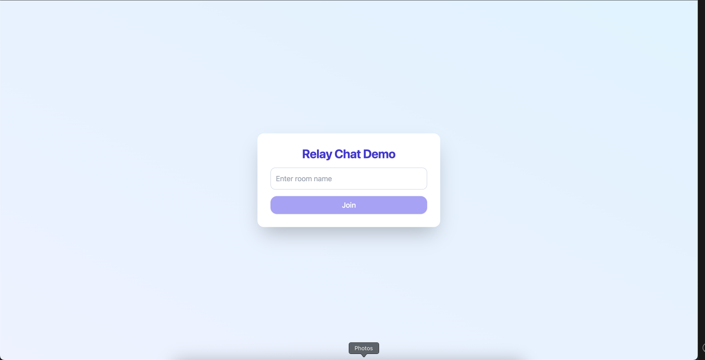
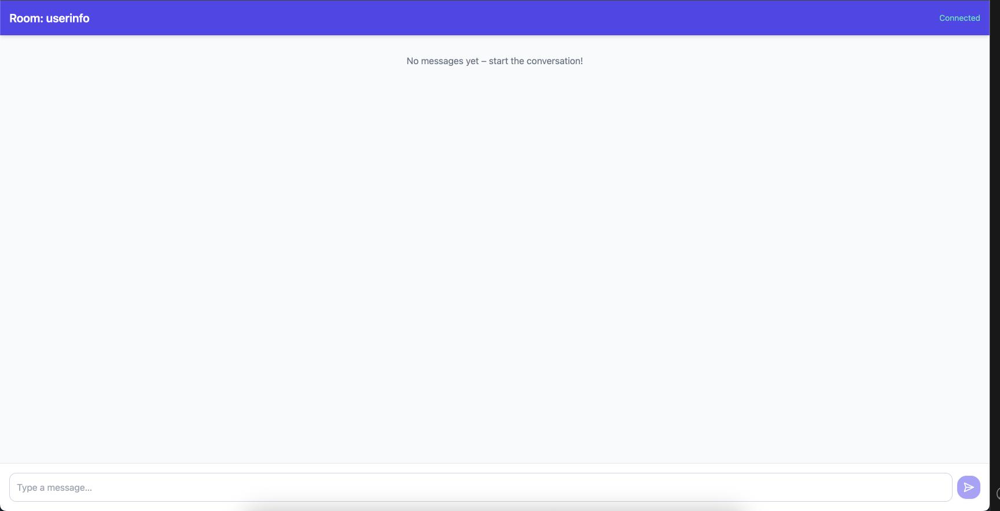
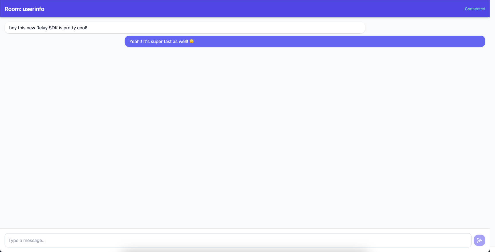

# Relay Chat Demo

A minimal React + Relay SDK example that lets you join a chat room and exchange messages in real‑time. The project is built with **Vite**, **React 18**, **TailwindCSS** and the Relay SDK.

---

## 1  Prerequisites

* **Node.js ≥ 18** — required only for the local dev tooling (Vite/React build). **Your end‑users do *****not***** need Node**; the compiled site runs entirely in the browser.
* A **Relay** account with:

  * **API Key** 
  * **Secret Key**

---

## 2  Clone & set your keys

```bash
# 1. Grab the repo (or unzip the archive you downloaded)
$ git clone https://github.com/Realtime-Relay/relayx-webjs.git
$ cd examples/chat-app

# 2. Export your Relay credentials *in the same shell session*:
#    (On Windows PowerShell use $Env: instead of export)
$ export VITE_API_KEY="pk_live_yourKeyHere"
$ export VITE_SECRET="sk_live_yourSecretHere"
```

> **Tip :** You can also create a `.env.local` (git‑ignored) and drop the two variables there:
>
> ```text
> VITE_API_KEY=pk_live_yourKeyHere
> VITE_SECRET=sk_live_yourSecretHere
> ```

---

## 3  Install packages

```bash
npm install         # or yarn / pnpm install
```

---

## 4  Run the dev server

```bash
npm run dev         # Vite will serve http://localhost:5173
```

To create an optimised production build:

```bash
npm run build       # output in /dist
npm run preview     # serve the built bundle locally
```

---

## 5  Using the app (walk‑through)

All screenshots live in `./screenshots`.

| Step | Action                                                                                                                                       | Screenshot                                    |
| ---- | -------------------------------------------------------------------------------------------------------------------------------------------- | --------------------------------------------- |
| 1    | **Landing page.** Enter a room name (e.g. `userinfo`) and click **Join**.                                                                     |    |
| 2    | **Chat view (empty).** The header shows the room and connection status. When the **Connected** badge turns green you can type.               |      |
| 3    | **Exchange messages.** Open another tab/browser, join the same room, and start chatting—messages appear instantly thanks to Relay’s pub‑sub. |  |

---

## 6  Troubleshooting

| Problem                         | Fix                                                                    |
| ------------------------------- | ---------------------------------------------------------------------- |
| **White screen / build errors** | Make sure Node ≥ 18 and you ran `npm install`.                         |
| **“Not authorised” messages**   | Double‑check `VITE_API_KEY` / `VITE_SECRET`.               |
| **Connection shows Offline**    | Browser can’t reach Relay cluster—check network/firewall or try again. |

---
